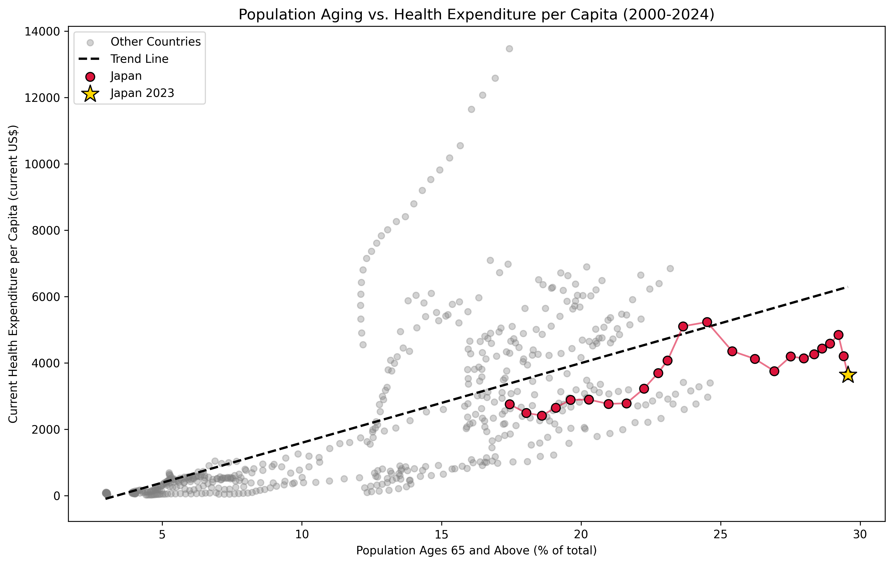

# Aging and Health Expenditure Analysis


An international comparative analysis of the relationship between population
aging and health expenditure across 23 countries (2000-2024), using World
Bank Open Data — with a focus on where Japan, the world's most aged country,
stands relative to the global trend.

## Research Question

Is there a systematic relationship between the share of a country's elderly
population (65+) and its per-capita health expenditure? And where does
Japan — an outlier in demographic aging — stand relative to that relationship?

## Key Finding



Despite having the highest share of population aged 65+ among the 23
countries studied (29.6% in 2023), Japan's health expenditure per capita is
consistently **below** the global trend — about 42% lower in the most recent
year, and below trend in 22 of the 24 years examined. Peer comparison
sharpens the picture: Germany, less aged (22.8%), spends about 37% **above**
trend, while Italy, aging at a similar pace to Japan, is also below trend
(-34.4%). This suggests population aging alone does not determine health
spending — national health-policy choices play a decisive role.

Full analysis: [Persian report](docs/report_fa.md) · [English report](docs/report_en.md)

## Data

| Indicator | Code | Source |
|---|---|---|
| Population ages 65 and above (% of total) | `SP.POP.65UP.TO.ZS` | [World Bank](https://data.worldbank.org/indicator/SP.POP.65UP.TO.ZS) |
| Current health expenditure per capita (current US$) | `SH.XPD.CHEX.PC.CD` | [World Bank](https://data.worldbank.org/indicator/SH.XPD.CHEX.PC.CD) |

Licensed under CC BY 4.0. See [`data/raw/README.md`](data/raw/README.md) for full attribution.

## Methodology

1. **Data loading & reshaping** — convert World Bank wide-format indicators to long format, filtered to 23 countries
2. **Cleaning & merging** — restrict to 2000+, merge both indicators, drop incomplete cases (561 country-year rows)
3. **Trend analysis** — linear regression (`numpy.polyfit`) across the full sample; correlation r = 0.650
4. **Japan-specific analysis** — residuals from the trend line, year by year, and peer comparison with Germany and Italy

## Repository Structure

```
├── data/raw/           # Raw World Bank datasets + attribution
├── notebooks/          # analysis.ipynb — full analysis pipeline
├── outputs/
│   ├── figures/        # Trend visualization (PNG, PDF)
│   └── tables/         # Japan vs. peer countries (CSV)
└── docs/                # Full reports (Persian & English)
```

## Running This Project

```bash
git clone https://github.com/Sepehr-Yg/aging-health-expenditure-analysis.git
cd aging-health-expenditure-analysis
pip install -r requirements.txt
jupyter notebook notebooks/analysis.ipynb
```

## Citation

If you use this analysis, please cite it — see [`CITATION.cff`](CITATION.cff).

## License

This project is licensed under the [MIT License](LICENSE).
